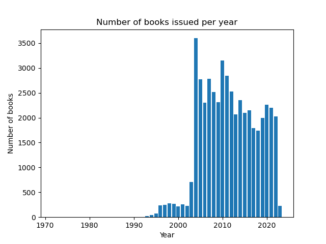

# Introduction

This repository contains all code written for the master project "Efficient Methods for Machine Learning" at the University of Hamburg in the summer semester 2024. The goal of the project is to train a language model from scratch and to this as data and compute sparing as possible. The project is supervised by Sören Laue & Michaela Regneri.

We set ourselves the goal to train a language model to generate episodes (or at least parts of) scripts from the TV show South Park.

The scripts are crawled from the [South Park Fandom](https://southpark.fandom.com/wiki/Portal:Scripts) website. We then clean the scripts and use them as our main dataset. But due to legal uncertainty whether we can publish the crawled scripts here, we only include the crawler script `data/southpark_crawler.py` in the repository.

# Setup

In order to run the code in this repository, you need to set up a Python environment with the required dependencies and set up a Weights & Biases account. Just follow the instructions in [Installation](#installation) and [Weight & Biases setup](#weight--biases-setup). If you have an Apple Silicon chip, you can follow the instructions in [Apple Silicon setup](#apple-silicon-setup). If you have a CUDA compatible GPU, you can follow the instructions in [CUDA setup](#cuda-setup).

## Installation

Clone the project onto your drive with one the following commands.
You'll need to have your preferred way to authenticate to Github ready.
[How to authenticate to Github](https://docs.github.com/en/authentication/keeping-your-account-and-data-secure/about-authentication-to-github#authenticating-with-the-command-line)

```bash
# Either
git clone https://github.com/Casparvolquardsen/SouthParkGPT.git southpark-gpt
# or
git clone git@github.com:Casparvolquardsen/SouthParkGPT.git southpark-gpt
```

Navigate into the project directory:

```bash
cd southpark-gpt
```

Our project uses Python 3.9. Using any other python version might cause issues.
To set up the project locally, you need to install the dependencies. We recommend to use a virtual environment for this. You can create a virtual environment with the following terminal command:

```bash
python3 -m venv venv
```

Then you can activate the virtual environment with the following command:

```bash
source venv/bin/activate
```

After that you can install the dependencies with the following command:

```bash
pip install -r requirements.txt
```

## Apple Silicon setup

If you have a Apple Silicon chip, you can install the dependencies from the 'mps_support' directory. You need to use `conda` package manager for this.

1. Install Miniforge:
   Since the regular Anaconda distribution doesn’t fully support ARM architecture yet, you’ll need Miniforge to set up a conda environment that works on the M1 chip.

- Downnload the Miniforge installer script for macOS ARM64 from [here](https://github.com/conda-forge/miniforge) or use the file in the `mps_support` directory.
- Open a terminal and run the following commands to install Miniforge:

```bash
cd mps_support
chmod +x Miniforge3-MacOSX-arm64.sh
./Miniforge3-MacOSX-arm64.sh
```

2. Create a Conda Environment and install dependencies:
   After installing Miniforge, you should create a new conda environment to manage your PyTorch installation and dependencies.

- In your terminal, create a new conda environment using the `mps_support/environment.yml` file.

```bash
conda env create -f environment.yml
```

3. Activate the new environment:

```bash
conda activate southpark-ml-project-env
```

4. Verify the installation:

- To verify that PyTorch has been installed correctly and is using the Apple Silicon GPU, run the following command:

```bash
python -c "import torch; print(torch.backends.mps.is_built() and torch.backends.mps.is_available())"
```

The output should be `True`.

# CUDA setup

If you have a CUDA compatible GPU, you'll want to ensure that pytorch is installed with CUDA support.
You can veryify that PyTorch is installed with CUDA support by running the following command:

```bash
python -c "import torch; print(torch.cuda.is_available())"
```

If it does not output `True`, you need to manually install PyTorch with CUDA support.

Make sure you have the latest NVIDIA drivers installed and set up. You can find an installation guide [here](https://docs.nvidia.com/cuda/cuda-installation-guide-linux/index.html).
Now, install PyTorch with CUDA support. You can use the official PyTorch website’s command generator at [PyTorch Get Started](https://pytorch.org/get-started/locally/) to get the correct installation command tailored to your system.
Using pip, you can install PyTorch with CUDA support with the following command:

Replace cu113 with the version that corresponds to your CUDA version.

```bash
# For PyTorch with CUDA
pip install torch torchvision torchaudio --extra-index-url https://download.pytorch.org/whl/cu113
```

Verify that it works with the command above (here it is again)

```bash
python -c "import torch; print(torch.cuda.is_available())"
```

## Weight & Biases setup

We use Weights & Biases for logging our training runs. You need to create an account on the Weights & Biases website and get your API key. You can find the API key in your account settings. You need to log in to your account with the following command:

```bash
wandb login
```

You’ll be prompted to enter your API key.

## Running the code

After you have set up a sufficient Python environment and installed the dependencies, you can run the code. We have two main scripts: `main.py` and `generate.py`.

### main.py

The `main.py` script is used to train a model and log the training runs to Weights & Biases. You can run the script with the following command:

```bash
python main.py
```

This will start a training run with the default hyperparameters without logging to Weights & Biases. Model parameters will be saved in the `models_params` directory and uploaded to Weights & Biases.
There are two ways to customize the parameters of the training run:

1. You can pass the hyperparameters as command line arguments. For example, to activate logging to W&B, you can run the following command:

```bash
python main.py --log_wandb=True
```

You can find a complete list of the available command line arguments with a corresponding description by running the following command:

```bash
python main.py --help
```

2. You can create a configuration file in the `config_files` directory. This way it is easier to reuse the same configuration for multiple runs, track changes and share configurations. You can find an example configuration in the `config_files/example_config.yml` file. You can run the script with a configuration file with the following command:

```bash
python main.py --config="config_files/example_config.yml"
```

### generate.py

The `generate.py` script is used to generate text with a trained model. You can run the script with the nearly same command line arguments as the `main.py` script. You can find a complete list of the available command line arguments with a corresponding description by running the following command:

```bash
python generate.py --help
```

You can use one of the example trained models in the `models_params/examples` directory to generate text. For example, you can run:

```bash
python generate.py --pretrained_model='models_params/examples/example1_finetuned_southpark_decoder-transformer.pth'
```

You can also specify a prompt to generate text with a specific starting text and also specify how many tokens to generate. For example, you can run:

```bash
python generate.py --pretrained_model='models_params/examples/example1_finetuned_southpark_decoder-transformer.pth' --prompt=",At the South Park Elementary, the students are discussing the latest news"  --max_len_generate=1000
```

To use our final model, with a context_length of 1024, you can use the following command:

```bash
python generate.py --pretrained_model='models_params/examples/example_long_context_finetuned_southpark_decoder-transformer.pth' --prompt=',At the South Park Elementary, the students are discussing the latest news.' --context_len=1024 --max_len_generate=10000
```

## Unit tests

We have written unit tests for important functions and sanity checks. You can run the unit tests with the following command:

```bash
pytest
```

## Datasets

### SouthPark Scripts

We use the scripts of all Southpark episodes, which are available on [southpark.fandom.com](https://southpark.fandom.com/wiki/Portal:Scripts).
We crawled the scripts from the website, where they were available as HTML tables. We parsed the tables and saved them as CSV tables, retaining the structure of the tables.

We then also cleaned the scripts, removing all special characters (like chinese characters, emojis, etc.).
This resulted in the dataset containing the following chars:

```
\n !"#$%&'()*+,-./0123456789:;<=>?@ABCDEFGHIJKLMNOPQRSTUVWXYZ[\]^_abcdefghijklmnopqrstuvwxyz{|}
```

Since this data set alone is from small size (~10MB), we predict that it alone will not suffice to generate meaningful and new scripts/dialogue parts we want to use additional english text data in addition for pretraining.

#### Stats

| Dataset statistic    |     Value |
| :------------------- | --------: |
| Number of characters | 9_261_303 |
| Number of words      | 1_507_194 |
| Number of lines      |    97_612 |
| Number of episodes   |       320 |

| Tokenizer                        | Number of tokens |
| :------------------------------- | ---------------: |
| gpt2                             |        2_540_796 |
| bpe-metaspace-256                |        5_119_910 |
| bpe-metaspace-512                |        4_122_716 |
| bpe-metaspace-1024               |        3_432_945 |
| bpe-metaspace-2048               |        2_936_421 |
| bpe-metaspace-4096               |        2_564_243 |
| bpe-metaspace-8192               |        2_293_703 |
| bpe-metaspace-16384              |        2_085_835 |
| bpe-metaspace-32768              |        1_999_068 |
| bpe-metaspace-punctuation-256    |        5_305_061 |
| bpe-metaspace-punctuation-512    |        4_406_355 |
| bpe-metaspace-punctuation-1024   |        3_786_046 |
| bpe-metaspace-punctuation-2048   |        3_362_205 |
| bpe-metaspace-punctuation-4096   |        3_062_276 |
| bpe-metaspace-punctuation-8192   |        2_848_014 |
| bpe-metaspace-punctuation-16384  |        2_705_840 |
| bpe-metaspace-punctuation-32768  |        2_705_840 |
| bpe-whitespace-punctuation-256   |        6_190_270 |
| bpe-whitespace-punctuation-512   |        5_469_924 |
| bpe-whitespace-punctuation-1024  |        4_960_312 |
| bpe-whitespace-punctuation-2048  |        4_596_302 |
| bpe-whitespace-punctuation-4096  |        4_337_824 |
| bpe-whitespace-punctuation-8192  |        4_157_400 |
| bpe-whitespace-punctuation-16384 |        4_044_634 |
| bpe-whitespace-punctuation-32768 |        3_985_740 |

### Additional dataset cleaning

In a second step, we cleaned the dataset further. We wrote a script using the OpenAI GPT-4o API to correct spelling and formatting errors in the dataset. We also replaced all non-english text with its english translation. The files in this dataset are no valid csv files anymore, since we saw no real value in keeping this and rather wanted quotes to indicate speech instead of csv cells. This resulted in the dataset containing the following stats:

Contained characters:

```
\n !"#$%&'()*+,-./0123456789:;=>?@ABCDEFGHIJKLMNOPQRSTUVWXYZ[\]_abcdefghijklmnopqrstuvwxyz{}
```

| Dataset statistic    |     Value |
| :------------------- | --------: |
| Number of characters | 9_464_453 |
| Number of words      | 1_650_488 |
| Number of lines      |    97_320 |
| Number of episodes   |       320 |

| Tokenizer                        | Number of tokens |
| :------------------------------- | ---------------: |
| gpt2                             |        2_645_535 |
| bpe-metaspace-256                |        5_408_876 |
| bpe-metaspace-512                |        4_408_487 |
| bpe-metaspace-1024               |        3_742_422 |
| bpe-metaspace-2048               |        3_266_730 |
| bpe-metaspace-4096               |        2_758_775 |
| bpe-metaspace-8192               |        2_502_578 |
| bpe-metaspace-16384              |        2_299_998 |
| bpe-metaspace-32768              |        2_214_748 |
| bpe-metaspace-punctuation-256    |        5_513_513 |
| bpe-metaspace-punctuation-512    |        4_616_172 |
| bpe-metaspace-punctuation-1024   |        3_999_017 |
| bpe-metaspace-punctuation-2048   |        3_578_651 |
| bpe-metaspace-punctuation-4096   |        3_283_946 |
| bpe-metaspace-punctuation-8192   |        3_072_418 |
| bpe-metaspace-punctuation-16384  |        2_930_145 |
| bpe-metaspace-punctuation-32768  |        2_930_145 |
| bpe-whitespace-punctuation-256   |        6_411_811 |
| bpe-whitespace-punctuation-512   |        5_701_827 |
| bpe-whitespace-punctuation-1024  |        5_199_226 |
| bpe-whitespace-punctuation-2048  |        4_836_910 |
| bpe-whitespace-punctuation-4096  |        4_575_052 |
| bpe-whitespace-punctuation-8192  |        4_392_871 |
| bpe-whitespace-punctuation-16384 |        4_275_554 |
| bpe-whitespace-punctuation-32768 |        4_212_987 |

### Pretraining

We pretrain on a plain english dataset. For this we use a subset of the Gutenberg corpus which is in english language. The dataset is called `gutenberg_english` and is available on [Huggingface datasets](https://huggingface.co/datasets/sedthh/gutenberg_english).

Stats:

- The dataset is ~10GB in size. That are around 48k books and results in ~5 billion tokens (with the gpt2 tokenizer).

| Gutenberg dataset statistic | Value          |
| :-------------------------- | -------------- |
| Number of characters        | 17_940_284_218 |
| Number of words             | 2_971_848_939  |
| Number of lines             | 582_660_361    |

Distribution of the issued year of the books is shown in the following histogram:



# Model

We use an adapted version from the nanoGPT model. The model is a standard decoder only transformer model. We have a bunch of hyperparameters for the model architecture which are the following:

- architecture: Which transformer implementation to use.
- bias: If to use bias in the linear layers.
- d_model: The dimension of the model (also often called the embedding size).
- dim_feedforward: The dimension of the hidden layers in th feedforward network of the transformer blocks (usually 4xd_model).
- dropout: The dropout rate.
- num_heads: The number of heads in the multihead attention.
- num_layers: The number of transformer blocks.
- use_attn_mask: If to use attention mask in the multihead attention layers while training.
- layer_norm_first: When to apply layer normalization in the transformer blocks, for the current implementation it is fixed to apply it first.
- positional_encoding: The type of positional encoding to use. For the current implementation it is fixed to a learned embedding.

# Training

We do log all our training runs to our Weights&Biases project. You can find the project [here](<https://wandb.ai/caspar_florens/Efficient%20Methods%20for%20Machine%20Learning%20(Master%20Project)?nw=nwusercaspar_florens>).
While training, we log metrics specific to each step (each batch) and some specific to the gradient accumulation step (could be multiple steps) and some specific to the epoch.

# Evaluation

We do train the model on the majority of the southpark dataset, but split of one validation and one test dataset. With these datasets we were especially careful, that the samples have no overlap with samples from the training dataset.
While training, we log the cross entropy loss, the accuracy (how many tokens were predicted correctly) and the top-10 accuracy (how many tokens were in the top-10 predictions of the model).
Every k (1000) steps/batches we evaluate the model on the validation dataset and log the same metrics as during training. We also save the model with the best validation loss.
After training, we evaluate the model on the test dataset and log the same metrics as during training.

# Results

A summary of our results can be found [here](results.md).


# References
1. **Leunen, M.-C. van.**  
   *A Handbook for Scholars.*  
   Oxford University Press, 1992.

2. **Taylor, B. N.**  
   *Guide for the Use of the International System of Units (SI).*  
   NIST Special Publication 811, 1995.  
   [Online](http://physics.nist.gov/Document/sp811.pdf)

3. **Hochreiter, S., & Schmidhuber, J.**  
   *Long Short-Term Memory.*  
   Neural Computation, 9(8), 1735-1780. MIT Press, 1997.

4. **Vaswani, A., et al.**  
   *Attention Is All You Need.*  
   CoRR, abs/1706.03762, 2017.  
   [arXiv](http://arxiv.org/abs/1706.03762)

5. **Liu, P. J., et al.**  
   *Generating Wikipedia by Summarizing Long Sequences.*  
   CoRR, abs/1801.10198, 2018.  
   [arXiv](http://arxiv.org/abs/1801.10198)

6. **Bahdanau, D., Cho, K., & Bengio, Y.**  
   *Neural Machine Translation by Jointly Learning to Align and Translate.*  
   arXiv preprint, arXiv:1409.0473, 2014.

7. **Lin, T., et al.**  
   *A Survey of Transformers.*  
   AI Open, 3, 111-132, 2022.  
   [DOI](https://doi.org/10.1016/j.aiopen.2022.10.001)

8. **Loshchilov, I., & Hutter, F.**  
   *SGDR: Stochastic Gradient Descent with Warm Restarts.*  
   arXiv preprint, arXiv:1608.03983, 2016.

9. **Weights & Biases.**  
   *Weights & Biases.*  
   [Website](https://www.wandb.com)

10. **South Park Archives.**  
    *South Park Archives.*  
    [Website](https://southpark.fandom.com/wiki/South_Park_Archives) (Accessed: August 15, 2024)

11. **Hugging Face.**  
    *English Gutenberg Corpus Dataset.*  
    [Website](https://huggingface.co/datasets/sedthh/gutenberg_english) (Accessed: August 15, 2024)

12. **Kirkpatrick, J., et al.**  
    *Overcoming Catastrophic Forgetting in Neural Networks.*  
    Proceedings of the National Academy of Sciences, 114(13), 3521-3526, 2017.

13. **Papineni, K., et al.**  
    *BLEU: A Method for Automatic Evaluation of Machine Translation.*  
    Proceedings of the 40th Annual Meeting of the Association for Computational Linguistics, 311-318, 2002.  
    [DOI](https://doi.org/10.3115/1073083.1073135)

14. **Parisi, G. I., et al.**  
    *Continual Lifelong Learning with Neural Networks: A Review.*  
    Neural Networks, 113, 54-71, 2019.  

15. **Radford, A., et al.**  
    *Language Models Are Unsupervised Multitask Learners.*  
    OpenAI Blog, 1(8), 2019.

16. **Brown, T. B., et al.**  
    *Language Models Are Few-Shot Learners.*  
    arXiv preprint, arXiv:2005.14165, 2020.  
    [arXiv](https://arxiv.org/abs/2005.14165)

17. **Zimerman, I., & Wolf, L.**  
    *On the Long Range Abilities of Transformers.*  
    arXiv preprint, arXiv:2311.16620, 2023.

18. **Lin, Y.-T., & Chen, Y.-N.**  
    *LLM-Eval: Unified Multi-Dimensional Automatic Evaluation for Open-Domain Conversations with Large Language Models.*  
    arXiv preprint, arXiv:2305.13711, 2023.  
    [arXiv](https://arxiv.org/abs/2305.13711)

19. **Stureborg, R., Alikaniotis, D., & Suhara, Y.**  
    *Large Language Models Are Inconsistent and Biased Evaluators.*  
    arXiv preprint, arXiv:2405.01724, 2024.  
    [arXiv](https://arxiv.org/abs/2405.01724)

20. **Karpathy, A.**  
    *GitHub Repository nanoGPT.*  
    [GitHub](https://github.com/karpathy/nanoGPT) (Accessed: August 20, 2024)

21. **Xie, Z., et al.**  
    *The Next Chapter: A Study of Large Language Models in Storytelling.*  
    arXiv preprint, arXiv:2301.09790, 202
